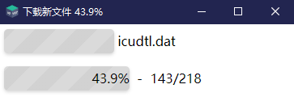
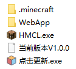
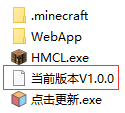

# 客户端安装指南

客户端最新版本号: `V1.0.0`

## 极简客户端下载

[点击](https://qiaoshouzi.lanzoui.com/s/heigeyuan)进入下载中心，密码请**前往QQ群**获取

下载`黑鸽院客户端.zip`到本地一个**你喜欢的位置**并解压

单击`点击更新.exe`从云端补齐文件

从云端补齐文件后如图

`HMCL.exe`为游戏启动器

`WebApp/黑鸽院.exe`为网页客户端

## 注意

请勿每天都更新，更新时将会在**QQ群**通知，并且在`WebApp`或[heigeyuan.com的首页](/)都会有写**最新版本的版本号**

通过**查看本地文件**中的`当前版本Vx.x.x`与**最新版本号**做对比**选择是否更新**

